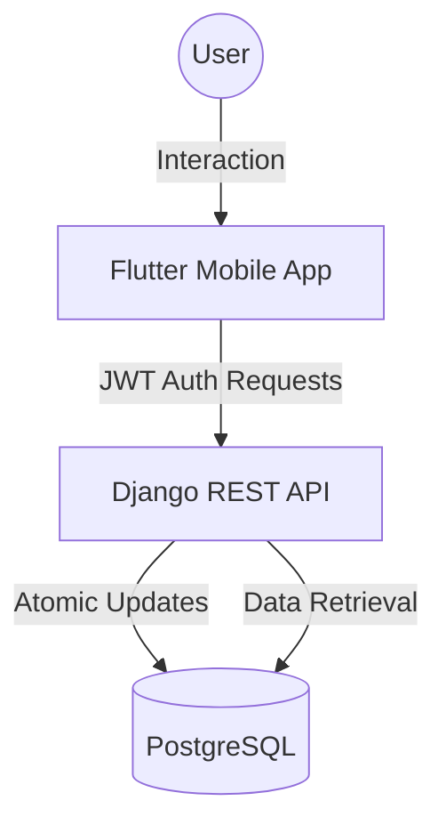

# Requirements

### Overview & Goals
The goal is to conduct a thorough code review across the entire project (Backend, Mobile, and Infrastructure) and resolve all identified bugs, logical errors, and technical debt to ensure a production-ready state.

### Scope
- **In Scope**:
  - Python/Django backend apps (`users`, `transactions`, `goals`, `cards`, `analytics`).
  - Flutter mobile app (`lib/core`, `lib/features`).
  - Project structure and configuration files (`Dockerfile`, `docker-compose.yml`, `settings.py`).
  - Security, atomicity, and consistency across components.
- **Out of Scope**:
  - Implementation of entirely new features not requested by the user.
  - Changes to the underlying database schema unless required to fix a bug.

# Technical Design

### Current Implementation
- **Backend**: Django REST Framework with SimpleJWT authentication. Uses `F()` expressions for some updates but missing in others (e.g., goals).
- **Mobile**: Flutter with Riverpod and Dio. Robust `Env` configuration but mixed error message handling.
- **Infrastructure**: Standard Docker setup with a few leftover "ghost" files in the root.

### Key Decisions
- **Atomicity via F() Expressions**: Chosen to prevent race conditions in financial updates without the overhead of heavy locks.
- **Ghost File Removal**: Decluttering the root directory to follow best practices and remove unprofessional leftovers.
- **Package Integrity**: Ensuring `__init__.py` files exist to guarantee proper module discovery.

### Proposed Changes
- **Backend**:
  - Update `apps/goals/views.py` to use `F('current_amount') + amount` in `add_progress`.
  - Add missing `__init__.py` files if found.
  - Refine serializer validation to be more explicit about user ownership.
- **Mobile**:
  - Audit `AuthRepository` for null safety and robust error parsing.
  - Ensure UI components handle backend errors gracefully.
- **Root**:
  - Delete `Shaxsiy`, `_obscurePassword`, and `context.go(...)` files.

### Architecture Diagram

# Testing

### Validation Approach
- **Automated Tests**: Run `pytest` for the backend to ensure all existing and new scenarios pass.
- **Manual Verification**: Use `api_client` or manual observation to verify specific fixes like race condition prevention.
- **Mobile Audit**: Static analysis of Dart code for null-safety and error-handling gaps.

### Key Scenarios
- **Race Condition**: Simultaneous calls to `add-progress` must result in a correct total sum.
- **Registration**: Duplicate email and password mismatch must be handled correctly on both ends.
- **Token Refresh**: Expired access tokens must be refreshed automatically without user intervention.

# Delivery Steps

### ✓ Step 1: Conduct comprehensive project-wide audit and bug identification
A detailed report of discovered bugs, security risks, and technical debt.

- Search for and document any logical bugs, race conditions (e.g., in `GoalViewSet.add_progress`), and potential security vulnerabilities.
- Identify unused or "ghost" files like 0-byte root files and missing `__init__.py` files.
- Evaluate consistency in error handling across backend and mobile components.
- Run existing tests to identify regressions or gaps.

### ✓ Step 2: Clean up project structure and structural fixes
Root directory is clean of "ghost" files and Python modules are correctly initialized.

- Remove unnecessary 0-byte files from the root directory (`Shaxsiy`, `_obscurePassword`, `context.go(...)`).
- Ensure every Python package in `apps/` has a valid `__init__.py` file.
- Verify `Dockerfile` and `docker-compose.yml` for any environment-specific bugs or misconfigurations.

### ✓ Step 3: Fix backend logic bugs and race conditions in Core Apps
Goal progress updates are atomic and reliable, and user serializers are robust.

- Refactor `GoalViewSet.add_progress` to use Django's `F()` expressions for atomic updates to prevent race conditions.
- Add validation to `add_progress` to ensure only positive increments are allowed (or handle negative properly).
- Review and refine `RegisterSerializer` and `TransactionSerializer` for any edge cases in user ownership validation.

### ✓ Step 4: Resolve mobile app logic and communication issues
Mobile authentication and API communication are resilient and consistent.

- Improve error handling in `AuthRepository.dart` to handle edge cases in response formats.
- Audit `auth_interceptor.dart` for correct token refresh behavior and infinite loop prevention.
- Ensure consistent error message handling and localization between backend responses and mobile UI.

### ✓ Step 5: Final verification and regression testing
All identified bugs are fixed, and the system is verified through testing and manual checks.

- Run all backend tests (`pytest`) to ensure no regressions were introduced.
- Verify mobile app connectivity and auth flow with the fixed backend.
- Conduct a final sweep for any remaining `DEBUG=True` or hardcoded secrets.