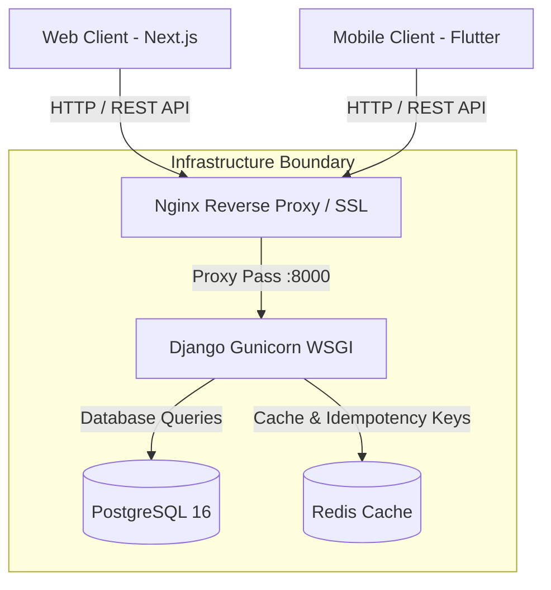

# System Architecture Specification

## 1. Overview & System Context

The Finance MVP application follows a decoupled multi-client monolithic architecture:
- **Backend**: Django REST Framework API server (`/api/v1/`).
- **Web Client**: Next.js 15 App Router frontend.
- **Mobile Client**: Flutter application using Riverpod for state management and Hive for offline-first persistence.
- **Database**: PostgreSQL 16 relational database.

---

## 2. Current vs Recommended Architecture

### Architectural Deficiencies Identified
1. **Cache Layer**: Currently using Django's default local-memory cache backend (`django.core.cache`), which fails in multi-process/multi-container setups. Redis must be configured.
2. **Middleware Execution Order**: Django middleware executes before DRF JWT authentication. `IdempotencyMiddleware` must extract and decode the Authorization header directly or run as a DRF decorator.
3. **Container Strategy**: Current Docker setup uses single-stage dev environments (`runserver` / `npm run dev`). Needs multi-stage Docker builds with Gunicorn and Next.js standalone mode.

---

## 3. Data Flow & Security Boundaries

### Authentication Flow (SimpleJWT)
1. Client POSTs credentials to `/api/v1/auth/token/`.
2. Backend validates user credentials and returns JWT `access` (60 min expiry) and `refresh` (7 days expiry) tokens.
3. Client attaches `Authorization: Bearer <access_token>` header on subsequent API requests.
4. When `access` token expires (401 response), client calls `/api/v1/auth/token/refresh/` using `refresh` token. Backend rotates refresh token (`ROTATE_REFRESH_TOKENS: True`) and blacklists the previous refresh token (`BLACKLIST_AFTER_ROTATION: True`).

### Idempotent Mutation Flow
1. Client generates unique UUID for `Idempotency-Key` header on POST/PUT/PATCH requests.
2. Middleware inspects `Authorization` bearer token to resolve `user_id`.
3. Checks Redis cache key `idempotency_<user_id>_<key>`.
4. If HIT: returns cached JSON response immediately with `X-Cache-Lookup: HIT-Idempotent`.
5. If MISS: processes request, caches 2xx HTTP response for 300s, and returns response to client.
